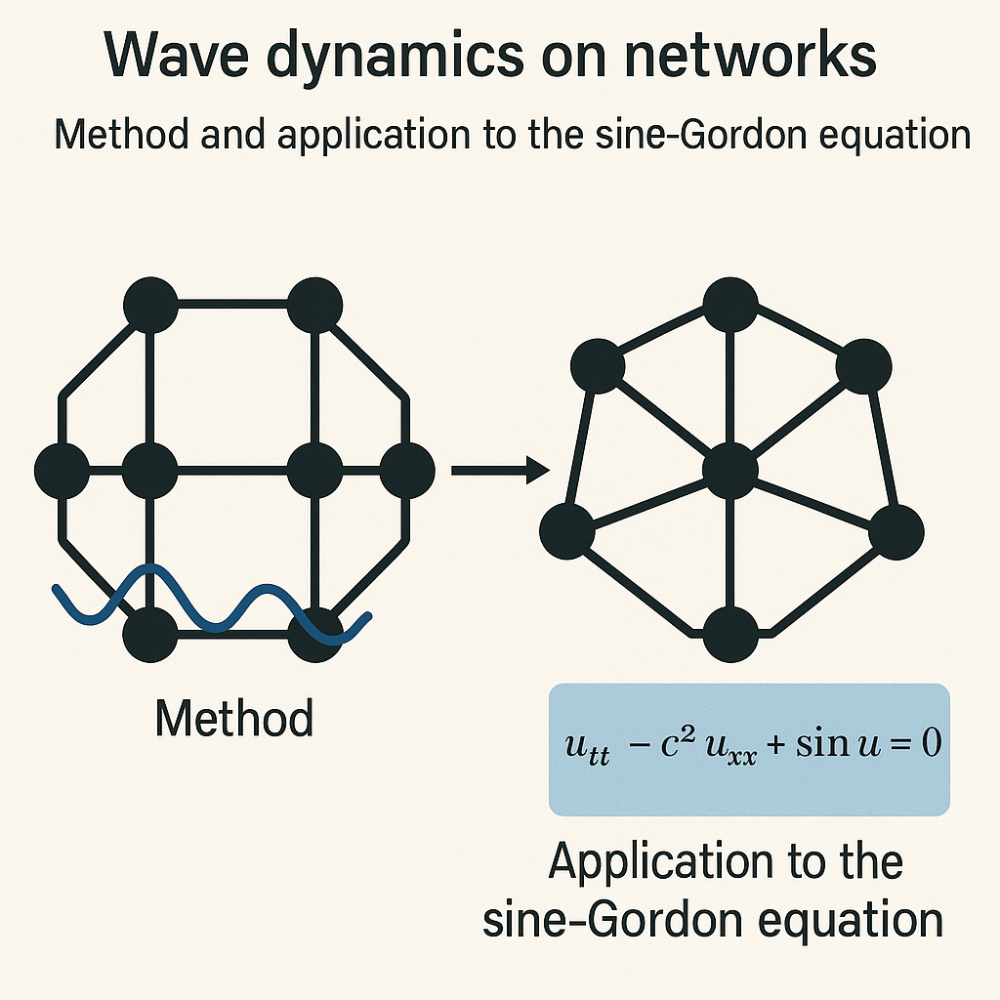

# sine-Gordon equation on graphs

This Matlab code solves the classical nonlinear sine-Gordon equation on graphs. For more information on the numerical method and on the interpretation of these results, please, refer to our preprint:

* D. Dutykh & J.-G. Caputo. [Wave dynamics on networks: Method and application to the sine-Gordon equation](https://www.sciencedirect.com/science/article/abs/pii/S0168927418301021), Applied Numerical Mathematics, Volume 131, September 2018, Pages 54-71

A couple of numerical simulations of kinks propagating in a closed network are given below:

And one simulation of a breather propagation in the same network:

## Authors

* [D. Dutykh](http://www.denys-dutykh.com/) ([CNRS](http://www.cnrs.fr/insmi/) - [LAMA](http://www.lama.univ-savoie.fr/index.php), [University Savoie Mont Blanc](https://www.univ-smb.fr/), France)
* [J.-G. Caputo](https://sites.google.com/site/jeanguycaputo/) ([INSA de Rouen](http://www.insa-rouen.fr/), France)

### Acknowledgements

Our Matlab code uses [Color brewer schemes](https://www.mathworks.com/matlabcentral/fileexchange/34087-cbrewer---colorbrewer-schemes-for-matlab).

---